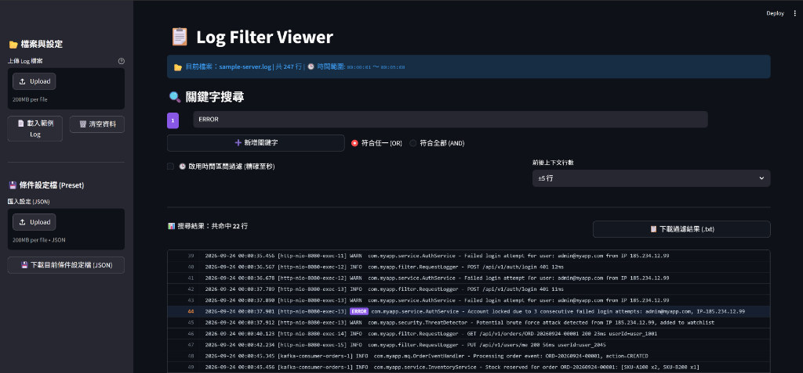

# Log Filter Viewer 🔍

> **專為工程師與維運團隊設計的日誌過濾檢視器 (Log Filter Viewer)**  
> 同時提供 **Streamlit 現代 Web 版** 與 **零依賴單一 HTML 版**。解決傳統文字編輯器看大量 Log 時「搜尋關鍵字看不到前後文」以及「前後文重疊時行數重複印出」的痛點。

---

## 🖥️ 畫面預覽 (Preview)



---

## 📖 圖文操作手冊 (User Manual)

本手冊依照上方實際操作介面，循序引導你快速掌握核心排查流程：

### 步驟 1：載入日誌檔案（左側邊欄）
* **方式 A：上傳自訂日誌**
  * 在左側「檔案與設定」區塊，點擊 **`Browse files` / `Upload`**，或直接將本機的 `.log`、`.txt`、`.out` 檔案拖入拖曳區。
* **方式 B：一鍵載入範例進行體驗**
  * 點擊 **`📄 載入範例 Log`** 按鈕，系統會立即載入專案內建的 `sample-server.log`（247 行實戰 Java 伺服器日誌）。
* **狀態確認**：
  * 載入成功後，主畫面上方資訊列會顯示檔名、總行數以及自動偵測的時間跨度：  
    `📂 目前檔案：sample-server.log | 共 247 行 | 🕒 時間範圍: 00:00:01 ～ 00:05:00`

---

### 步驟 2：設定關鍵字搜尋（支援多條件組合）
* **輸入關鍵字**：
  * 預設提供一組關鍵字框（預設帶有 `#1 紫色標籤`），輸入欲排查的字眼（如 `ERROR`）。
* **➕ 新增多組關鍵字**：
  * 點擊 **`➕ 新增關鍵字`** 按鈕，可動態擴充第二、第三組條件（如加入 `timeout`、`OrderService`）。
  * 每組關鍵字皆有獨立色彩（循環 6 色標籤），畫面中對應字眼會以相同顏色高亮呈現。
  * 若要移除某一組，點擊該行右側的 **`✕`** 即可。
* **選擇比對邏輯**：
  * **🔴 符合任一 (OR)**：只要日誌行包含其中任一關鍵字即命中（適合廣泛抓取多種異常特徵）。
  * **⚪ 符合全部 (AND)**：日誌行必須同時包含所有關鍵字才算命中（適合精準鎖定特定元件的特定錯誤）。

---

### 步驟 3：精準微調（時間過濾與上下文前後行）
* **🕒 啟用時間區間過濾 (精確至秒)**：
  * 勾選該選項後，會展開 **開始/結束日期**、**時:分下拉選單** 與 **秒數微調輸入框**。
  * 系統會自動帶入此檔案的最早與最晚時間，你可以手動將結束秒數由 `00:05:00` 縮減為 `00:01:30`，只聚焦故障發生的那 90 秒。
  * 若日誌包含多行 Exception Stack Trace（無獨立時間戳記），系統會智慧歸屬於前一行，保證錯誤堆疊不被裁切。
* **前後上下文行數 (Context)**：
  * 下拉選單可自訂展示範圍：`0行 (僅命中行)`、`±3行`、`±5行` (預設)、`±10行`、`±20行`、`±50行`。
  * 🧠 **智慧無重疊合併**：若第 44 行與第 46 行皆命中，系統會自動將重疊區間合為一個完整連續區塊，**同一個行號在畫面上絕不會重複列出兩次**。

---

### 步驟 4：閱讀日誌與快速定位
* **統計資訊**：即時顯示目前條件下的命中行數（如 `📊 搜尋結果：共命中 22 行`）。
* **視覺對比**：
  * **命中行 (Match)**：背景呈現深藍色（`#161f30`），左側行號以 **亮橘色粗體** 凸顯（例如 `44`），日誌中的關鍵字套用專屬色票高亮。
  * **上下文行 (Context)**：背景保持深黑色，提供故障發生前後的環境脈絡。
  * **區塊分隔線**：不同事件區段之間會顯示 `⋯⋯⋯⋯⋯⋯` 分隔線，避免日誌跳行時造成誤讀。

---

### 步驟 5：結果匯出與團隊設定共享
* **📋 下載過濾結果 (.txt)**：
  * 點擊搜尋結果右上方的 **`📋 下載過濾結果 (.txt)`** 按鈕，可將目前畫面上合併排版好的內容（含對齊行號與分隔線）直接下載為乾淨的純文字檔，方便附在 Jira Issue 或貼到 Slack 討論。
* **💾 條件設定檔 (Preset)**：
  * **匯出**：在左側邊欄點擊 **`💾 下載目前條件設定檔 (JSON)`**，可將當前的關鍵字、OR/AND 模式、前後行數設定打包儲存。
  * **匯入**：在左側「匯入設定 (JSON)」上傳該檔案，即可瞬間復原完整的搜尋條件，便於同事之間重現除錯場景。

---

## 📁 專案目錄結構

```text
log-filter-viewer/
├── streamlit_app/              # 現代化 Streamlit Web 應用模組
│   └── app.py                  # Streamlit 主程式 (支援自動轉接與雙點擊啟動)
├── standalone_html/            # 零依賴純前端單檔版本 (可離線獨立運作)
│   ├── index.html              # 主頁面
│   └── log-filter.html         # 完整功能單一檔案版
├── samples/                    # 測試範例與預設設定檔
│   ├── sample-server.log       # 247 行 Java 伺服器除錯範例 Log
│   └── example-preset.json     # 關鍵字與查詢條件預設檔範例
├── tests/                      # 自動化驗收測試套件
│   └── test_full.py            # 7 大核心模組端對端自動化測試
├── docs/                       # 文件資產
│   └── images/
│       └── preview.png         # 介面預覽截圖
├── start.bat                   # Windows 一鍵啟動腳本 (自動開瀏覽器與解除 6666 限制)
├── run.bat                     # Windows 啟動腳本別名
├── requirements.txt            # Python 依賴清單 (streamlit>=1.40.0)
├── LICENSE                     # 完整官方 MIT 開源授權條款
├── .gitignore                  # Git 忽略設定
└── README.md                   # 專案說明文件 (包含操作手冊與授權詳解)
```

---

## 🚀 快速啟動

### 方式一：Windows 一鍵啟動 (最推薦)

直接在專案根目錄雙擊執行 **`start.bat`**（或 `run.bat`）：
- 自動檢測 Python 環境與補齊依賴套件。
- 自動啟動 Streamlit 服務（Port 6666）。
- 自動開啟 Edge / Chrome 瀏覽器並帶上 `--explicitly-allowed-ports=6666` 參數解除瀏覽器安全阻擋。

### 方式二：手動指令啟動

```bash
# 1. 安裝套件
pip install -r requirements.txt

# 2. 啟動 Streamlit (Port 6666)
streamlit run streamlit_app/app.py --server.port 6666

# 或直接使用 Python 執行 (內建自動轉接)
py streamlit_app/app.py
```

### 方式三：純前端單檔版 (免安裝任何環境)

直接雙擊開啟 `standalone_html/index.html` 或 `standalone_html/log-filter.html` 即可使用。

---

## 🧪 自動化測試

本專案附帶完整的端對端自動化測試套件，涵蓋 7 大核心模組：

```bash
python tests/test_full.py
```

---

## 📄 授權條款 (MIT License)

本專案採用 **[MIT License](LICENSE)** 開源授權協議。

```text
MIT License

Copyright (c) 2026 ericlight0025

Permission is hereby granted, free of charge, to any person obtaining a copy
of this software and associated documentation files (the "Software"), to deal
in the Software without restriction, including without limitation the rights
to use, copy, modify, merge, publish, distribute, sublicense, and/or sell
copies of the Software, and to permit persons to whom the Software is
furnished to do so, subject to the following conditions:

The above copyright notice and this permission notice shall be included in all
copies or substantial portions of the Software.

THE SOFTWARE IS PROVIDED "AS IS", WITHOUT WARRANTY OF ANY KIND, EXPRESS OR
IMPLIED, INCLUDING BUT NOT LIMITED TO THE WARRANTIES OF MERCHANTABILITY,
FITNESS FOR A PARTICULAR PURPOSE AND NONINFRINGEMENT. IN NO EVENT SHALL THE
AUTHORS OR COPYRIGHT HOLDERS BE LIABLE FOR ANY CLAIM, DAMAGES OR OTHER
LIABILITY, WHETHER IN AN ACTION OF CONTRACT, TORT OR OTHERWISE, ARISING FROM,
OUT OF OR IN CONNECTION WITH THE SOFTWARE OR THE USE OR OTHER DEALINGS IN THE
SOFTWARE.
```

### 授權概要說明：
* 🟢 **允許自由使用**：個人、公司內部或商業專案皆可免費使用。
* 🟢 **允許修改與分發**：可任意修改原始碼、重新打包、發布或整合至其他軟體中。
* 🟡 **唯一義務條件**：分發代碼時，必須保留上述原始版權宣告（Copyright）與授權許可聲明。
* ⚪ **免責條款**：作者不對本軟體的使用結果承擔任何明示或暗示的法律擔保責任。

完整授權內文請參閱根目錄的 [LICENSE](LICENSE) 檔案。
